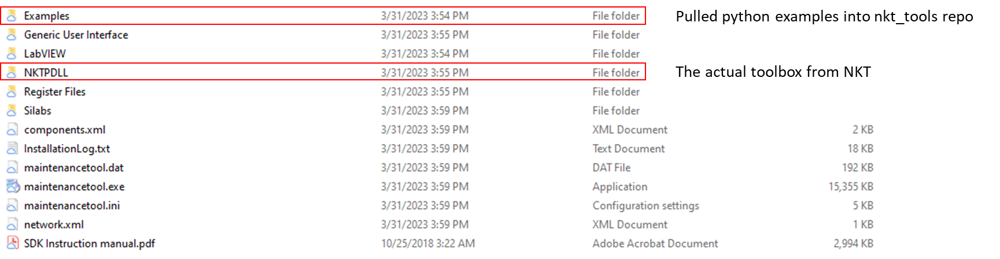
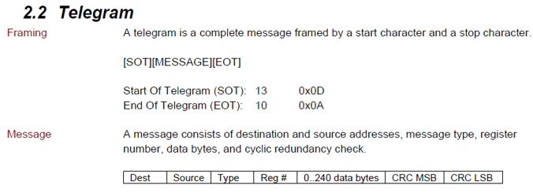
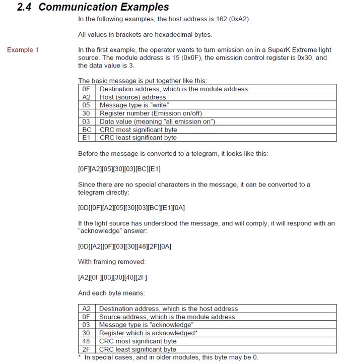

=================
Development Notes
=================

In this section, I will walkthrough the process I used to build the :mod:`nkt_tools` packages. This walkthrough is meant to serve as an example for users hoping to automate equipment using python. For example, this package is imported into my larger catalysis automation project, `catalight <https://catalight.readthedocs.io/en/latest/>`_.

Users interested in simply using this package need not read the following section. This is only meant for educational  purposes, but not necessary for use of :mod:`nkt_tools`.

Downloading the Software Development Kit (SDK)
----------------------------------------------

To begin, we first need to download the software development kit from `NKT's website <https://www.nktphotonics.com/support/>`_ (Note: the relevant files are included in the :mod:`nkt_tools` package). This will download a zip file, the contents of which include:

.. figure:: ./_static/images/unzip.png

After running the executable within, the following files will be available:

The most important content inside the installed directory include the Examples folder, NKTPDLL folder, and SDK Instruction Manual. The NKTPDLL folder contains the actual NKT toolbox used to automate NKT components and comes wrapped inside :mod:`nkt_tools`. The DLL gets imported through :mod:`nkt_tools.NKTP_DLL`. The examples folder provides usage of the DLL in multiple languages, including python. These examples have been included in the nkt_tools repo under manuals/dll_examples. Finally, the SDK instruction manual demonstrates how to communicate with NKT equipiment, what is and how to use the DLL, and how to address specific equipment. The :download:`instructions manual <../../manuals/SDK Instruction manual.pdf>` and the :download:`DLL reference guide <../../manuals/NKTPDLL Reference manual.pdf>` are both available under nkt_tools/manuals.

Communication Through Telegrams
-------------------------------

The :download:`instructions manual <../../manuals/SDK Instruction manual.pdf>` first describes the basic communcation procedure used to talk with NKT hardware:

Telegrams, specifically formated arrays of bytes, are sent back and forth between the computer and hardware. Exact bytes and specific locations in the array correspond to certain actions or identities of the hardware and control options. Here is an example of communcation utilizing a telegram.

Communcation Through the DLL
----------------------------

Its not necessary to learn how to communicate with the hardware in this way, as the DLL abstracts this process away to a great degree. The NKT instruction manaul does provide a good overview of the process, and many users will hopefully find a careful read over the manual to be very informative. For practical purposes, the DLL wraps over the creation of telegrams to simplify experimental communication, as described in the manual:

.. figure:: ./_static/images/nktpdll.png

Below is an example of turning on an NKT Extreme/Fianium laser using the DLL through python instead of creating a telegram from scratch. This example is provided from the original SDK download and posted in the repo under :download:`nkt_tools/manuals/dll_examples/Extreme_Emission_On.py <../../manuals/dll_examples/Extreme_Emission_On.py>`

.. code-block:: python

    import NKTP_DLL as nkt
    nkt.registerWriteU8('COM27', 15, 0x30, 0x03, -1)

Here is a break down of how the registerWrite function works and where different information is found within the two manuals:

.. figure:: ./_static/images/registerWrite_explained.png

Writing nkt_tools
-----------------

Up to this point, these are the exact tools provided by and downloaded from NKT. All the equipment could be operated using this alone, but the user would constantly need to refer to the user manual to detemine the correct device and register address for each command. Additionally, while most commands accept integer values as input, some parameters read/write byte arrays which many users will not be familiar with this. The purpose of :mod:`nkt_tools` is to wrap around the NKTPDLL to provide an even more simple interface that doesn't require reference to the manual to operate.

Importing the DLL
^^^^^^^^^^^^^^^^^

One major step in setting up the DLL when following the SDK installation instructions is installing the DLL path. The installer will determine the user's OS and link the relevant DLL folder somewhere on the user's computer for later access. The DLL can then be called without the full path as it is essentially stored in the device's configuration. Within :mod:`nkt_tools`, I have removed the need for the user to explicity install the DLL files using the installer by providing the DLL folder inside of the repository. The :mod:`nkt_tools.NKTP_DLL` module still needs to point to the correct DLL file. To accomplish this, I added the following lines to the code provided by NKT:

.. code-block:: python

    dllFolder = os.path.dirname(__file__)
    if (ctypes.sizeof(ctypes.c_voidp) == 4):
            print('Loading x86 DLL from:', dllFolder + r'\NKTPDLL\x86\NKTPDLL.dll')
            NKTPDLL = ctypes.cdll.LoadLibrary( dllFolder + r'\NKTPDLL\x86\NKTPDLL.dll' )
    else:
            print('Loading x64 DLL from:', dllFolder + r'\NKTPDLL\x64\NKTPDLL.dll')
            NKTPDLL = ctypes.cdll.LoadLibrary( dllFolder + r'\NKTPDLL\x64\NKTPDLL.dll')

This code block determines the users OS and points to the relevant DLL folder located within the same directory.

Autosearching for equipment
^^^^^^^^^^^^^^^^^^^^^^^^^^^

Next, I used the :download:`dll_examples/Find_Modules_Simple.py<../../manuals/dll_examples/Find_Modules_Simple.py>` example provided by NKT to learn how to automatically find connected NKT devices. The first two parameters when using any registerRead/registerWrite command are the module COM port and the device register. The COM port address depends on the physical port the equipment is connected to on your PC, while the device register is a number corresponding to the type of instrument (e.g. Extreme/Fianium vs Varia)

.. code-block:: python

    from NKTP_DLL import *

    print('Find modules on all existing and accessible ports - Might take a few seconds to complete.....')

    print(openPorts(getAllPorts(), 1, 1))

    # All ports returned by the getOpenPorts function has modules (ports with no modules will automatically be closed)
    print('Following ports has modules:', getOpenPorts())

    # Traverse the getOpenPorts list and retrieve found modules via the deviceGetAllTypes function
    portlist = getOpenPorts().split(',')
    for portName in portlist:
        result, devList = deviceGetAllTypes(portName)
        for devId in range(0, len(devList)):
            if (devList[devId] != 0):
                print('Comport:',portName,'Device type:',"0x%0.2X" % devList[devId],'at address:',devId)

    # Close all ports
    closeResult = closePorts('')
    print('Close result: ', PortResultTypes(closeResult))

I essentially copy this demo code within the init function of the :class:`~nkt_tools.extreme.Extreme` class:

.. code-block:: python

    # Open all ports
    nkt.openPorts(nkt.getAllPorts(), 1, 1)

    # Get open NKT ports
    portlist = nkt.getOpenPorts().split(',')
    extreme_found = False  # This is added to check for duplicate lasers

    for portName in portlist:  # Sweep open nkt ports
        # get binary devList of connected nkt devices
        comm_result, devList = nkt.deviceGetAllTypes(portName)

Up to this point, almost everything has been identical to the example. Now, I just grab the device type from a specific address and check that it is the correct one. Then I assign the device type and module address as attributes of the object instance.

.. code-block:: python

    # Get byte at location 15 (device address for extreme/fianium)
    device_type = devList[self.module_address]

    # Double check device_type matches extreme/fianium laser
    if hex(device_type) == '0x60':  # 96 == 0x60 in hex
        if extreme_found:  # If extreme found on other port, error
            err_msg = ('''Multiple NKT Lasers found on computer.
            COM port 1 = %s
            COM port 2 = %s
            Please initialize Extreme class with designated \
            portname to avoid conflict'''
                        % (self.portname, portName))

            raise RuntimeError(err_msg)

        else:  # If this is first laser found,
            extreme_found = True
            self._portname = portName
            self._device_type = device_type

The init function of the :class:`~nkt_tools.varia.Varia` is very similar, except that the Varia can had several different device addresses. In that init function, I loop through the possible decive addresses searching for a device type that matches the varia (0x68).

Writing equipment control methods
^^^^^^^^^^^^^^^^^^^^^^^^^^^^^^^^^

For the remainder of the code, I simply translated the options given by the DLL manual into methods for each class. Heres an example:

The manual provides this description of how to access the NIM delay setting on the NKT Extreme/Fianium

.. figure:: _static/images/manual_nim_delay.png

For the laser, I seperate read and write operations as an additional barrier to a user unintentionally setting dangerous conditions on the laser.

.. code-block:: python
    :caption: Here we read the nim_delay as a property of the object

    @property
    def nim_delay(self):
        register_address = 0x38
        step = 9e-12  # Step size for delay is 9 ps
        comm_result, delay = nkt.registerReadU16(self.portname,
                                                self.module_address,
                                                register_address, -1)
        self._nim_delay = delay * step
        return self._nim_delay

.. code-block:: python
    :caption: The setter function allows the user to write a new value for the nim delay

    def set_nim_delay(self, nim_delay):
        register_address = 0x38
        step = 9e-12  # Step size for delay is 9 ps
        int_delay = int(nim_delay/step)
        if (int_delay >= 0) and (int_delay <= 1023):
            nkt.registerWriteU16(self.portname, self.module_address,
                                 register_address, int_delay, -1)
        else:
            print('NIM Delay Value Out of Range (0 <= Delay <= 9.207e-9)')

The essential parts in both cases are

#. The register address is stored within the calling function. A user doesn't need to refer to the manual to remember the NIM delay address.
#. Any number conversion is handled within the function so that the user can provide the most logical unit. Here the user enters the delay time in seconds rather than an integer value from 0 to 1023.

For the Varia, almost everything works the same, except that all properties allow the user to get/set the value instead of having explicit setter functions.

.. code-block:: python

    from nkt_tools.extreme import Extreme

    laser = Extreme()
    laser.set_power(50)
    current_power = laser.power_level

.. code-block:: python

    from nkt_tools.varia import Varia

    varia = Varia()
    varia.short_setpoint = 490
    current_filter_power = varia.short_setpoint

.. _chatgpt:

How I Tried ChatGPT to Automatically Write Other NKT Modules
============================================================
At this point, the process of creating a new module is fairly formulaic. Scan the manual for register addresses and write class methods that read/write to those registers with more informative naming conventions. I thought this could be a perfect job for AI to help with since I little personal motivation to write modules for hardware our lab does not own. I attempted to leverage the ChatGPT web interface to write this new modules with limited success.

#. I realized quickly that ChatGPT puts a limit on the number of lines of text that can be sent at once. I utilized a `prompt text splitter <https://chatgpt-prompt-splitter.jjdiaz.dev/>`_ to split my requests into 47 seperate prompt, which I then copied and pasted into chatGPT.
#. I sent ChatGPT the manual entries in the DLL instruction manual for the extreme/varia followed by my python code. I saved the entry in the repository (:download:`chatgpt_auto_nkt_tools_prompt.docx <../../manuals/chatgpt_auto_nkt_tools_prompt.docx>`).
#. ChatGPT next output a fairly reasonable python file (:mod:`nkt_tools.chatgpt_select`). Without demoing this module on a real system, it appears that it may function correctly.
#. I next sent the manual entry for the NKT Extend UV tool and chatGPT produced the :mod:`nkt_tools.chatgpt_extend_uv` module. This version was messier than the orginal output for the Select, and I found chatGPT was producing a lot of style and format variation between modules. For this reason, I stopped trying to create these AI built modules.
#. I saved both AI built modules (Select and Extend UV) with the prefix "chatgpt" so so future users will know the modules were AI generated, but could try to use them as starting points if they'd like to.
